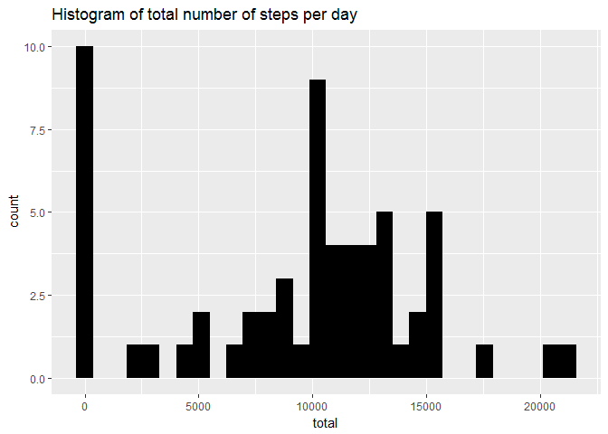
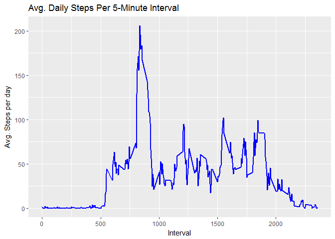
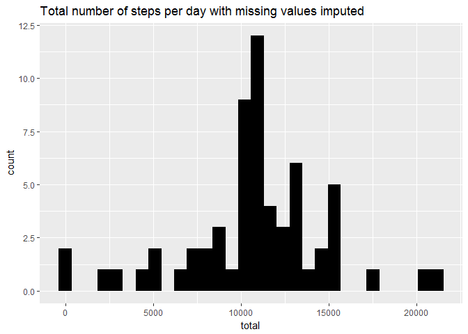
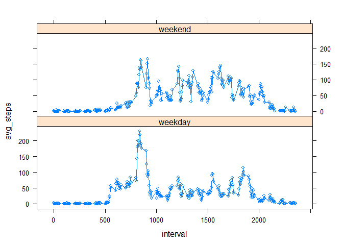

```
## 
## Attaching package: 'dplyr'
```

```
## The following objects are masked from 'package:stats':
## 
##     filter, lag
```

```
## The following objects are masked from 'package:base':
## 
##     intersect, setdiff, setequal, union
```

## Loading and preprocessing the data

```r
activity_df <- read.table(unz("activity.zip", "activity.csv"), header=TRUE, sep=",", na.strings = c("NA"), stringsAsFactors=F)
```

## What is mean total number of steps taken per day?
1. Calculate the total number of steps taken per day

```r
total_steps_per_day <- activity_df %>% group_by(date) %>% summarise(total = sum(steps, na.rm = TRUE))
head(total_steps_per_day)
```

```
## # A tibble: 6 x 2
##         date total
##        <chr> <int>
## 1 2012-10-01     0
## 2 2012-10-02   126
## 3 2012-10-03 11352
## 4 2012-10-04 12116
## 5 2012-10-05 13294
## 6 2012-10-06 15420
```
2. If you do not understand the difference between a histogram and a barplot, research the difference between them. Make a histogram of the total number of steps taken each day

```r
ggplot(total_steps_per_day, aes(x = total)) + geom_histogram(fill = "black") + labs(title = "Histogram of total number of steps per day") 
```

```
## `stat_bin()` using `bins = 30`. Pick better value with `binwidth`.
```

<!-- -->

3. Calculate and report the mean and median of the total number of steps taken per day

```r
mean_steps_per_day <- round(mean(total_steps_per_day$total))
med_steps_per_day <- round(median(total_steps_per_day$total))
```
The mean step count per day is 9354.  The median step count per day is 1.0395\times 10^{4}

## What is the average daily activity pattern?
1. Make a time series plot (i.e. type = "l") of the 5-minute interval (x-axis) and the average number of steps taken, averaged across all days (y-axis)


```r
# Create data frame with number of steps taken, averaged across all days
average_steps_per_interval <- activity_df %>% group_by(interval) %>% summarise(avg.intvl = mean(steps, na.rm = TRUE))

ggplot(average_steps_per_interval, aes(x = interval , y = avg.intvl)) + geom_line(color="blue", size=1) + labs(title = "Avg. Daily Steps Per 5-Minute Interval", x = "Interval", y = "Avg. Steps per day")
```

<!-- -->

2. Which 5-minute interval, on average across all the days in the dataset, contains the maximum number of steps?

# Find out which 5-minute interval contains the maximum number of steps

```r
max_step_interval_index <- which(average_steps_per_interval$avg.intvl == max(average_steps_per_interval$avg.intvl))
max_average_step_interval <- average_steps_per_interval[max_step_interval_index, 1]
```
The interval with the maximum average step count is 835

## Imputing missing values
1. Calculate and report the total number of missing values in the dataset (i.e. the total number of rows with NAs)

```r
# Calculate and report the total number of missing values in the dataset
# (the total number of rows with NAs)
number_of_na_rows <- nrow(activity_df) - sum(complete.cases(activity_df))
```
The total number of rows with missing values is 2304

2. Devise a strategy for filling in all of the missing values in the dataset. The strategy does not need to be sophisticated. For example, you could use the mean/median for that day, or the mean for that 5-minute interval, etc.
The following strategy is chosen.  We calculate the mean of the interval across date.  For any NA step variable, we pull the mean for the corresponding interval from the whole population and apply it to the missing value.

The 'average_steps_per_interval' contains the mean for each single interval calculated over the 61 days.

3. Create a new dataset that is equal to the original dataset but with the missing data filled in.

```r
# creation of the dataset that will have no more NAs
activity_inputted_missing_steps <- activity_df  
for (row.num in 1:nrow(activity_inputted_missing_steps)) {

    if (is.na(activity_inputted_missing_steps[row.num, "steps"])) {

        interval_signal <- activity_inputted_missing_steps[row.num, "interval"]
        interval_signal_index <- which(average_steps_per_interval[, "interval"] == interval_signal)
        interval_steps_mean <- average_steps_per_interval[interval_signal_index, "avg.intvl"]
        activity_inputted_missing_steps[row.num, "steps"] <- interval_steps_mean
    }
}
# If done correctly, the new dataset has the number complete cases equal to the number of rows
(nrow(activity_inputted_missing_steps) - sum(complete.cases(activity_inputted_missing_steps))) == 0
```

```
## [1] TRUE
```
4. Make a histogram of the total number of steps taken each day and Calculate and report the mean and median total number of steps taken per day. Do these values differ from the estimates from the first part of the assignment? What is the impact of imputing missing data on the estimates of the total daily number of steps?


```r
total_steps_per_day_imp <- activity_inputted_missing_steps %>% group_by(date) %>% summarise(total = sum(steps, na.rm = TRUE))
#calculate population stats
mean_steps_per_day_with_missing <- round(mean(total_steps_per_day_imp$total))
med_steps_per_day_with_missing <- round(median(total_steps_per_day_imp$total))

ggplot(total_steps_per_day_imp, aes(x = total)) + geom_histogram(fill = "black", bins=30) + labs(title = "Total number of steps per day with missing values imputed") 
```

<!-- -->

```r
print(c("The mean steps per day with missing values filled in is",mean_steps_per_day_with_missing)) 
```

```
## [1] "The mean steps per day with missing values filled in is"
## [2] "10766"
```

```r
print(c("The median steps per day with missing values filled in is",med_steps_per_day_with_missing))
```

```
## [1] "The median steps per day with missing values filled in is"
## [2] "10766"
```
In order to compare the means/medians of the actual dataframe and the imputted values

```r
summary_df <-data.frame(mean = c(mean_steps_per_day, mean_steps_per_day_with_missing), median = c(med_steps_per_day, med_steps_per_day_with_missing))
rownames(summary_df) <- c("with NA", "without NA")
print(summary_df)
```

```
##             mean median
## with NA     9354  10395
## without NA 10766  10766
```


## Are there differences in activity patterns between weekdays and weekends?
For this part the weekdays() function may be of some help here. Use the dataset with the filled-in missing values for this part.
1. Create a new factor variable in the dataset with two levels - "weekday" and "weekend" indicating whether a given date is a weekday or weekend day.

```r
weekdays_signal <- weekdays(as.Date(activity_inputted_missing_steps$date))
activity_inputted_missing_steps$day_type <- sapply(weekdays_signal, function(sgn) {
    if (sgn %in% c("Saturday", "Sunday")) {
        return("weekend")
    } else {
        return("weekday")
    }
})
activity_inputted_missing_steps$day_type  <- as.factor(activity_inputted_missing_steps$day_type)
```

2. Make a panel plot containing a time series plot (i.e. type = "l") of the 5-minute interval (x-axis) and the average number of steps taken, averaged across all weekday days or weekend days (y-axis). See the README file in the GitHub repository to see an example of what this plot should look like using simulated data.


```r
# Group data by interval and day type and get average steps number for each interval
day_type_steps_by_interval <- activity_inputted_missing_steps %>% group_by(interval, day_type) %>% summarise(avg_steps = mean(steps))

#Panel plot containing a time series plot 
xyplot(avg_steps ~ interval | day_type, data = day_type_steps_by_interval, type = "b",layout = c(1, 2))
```

<!-- -->
